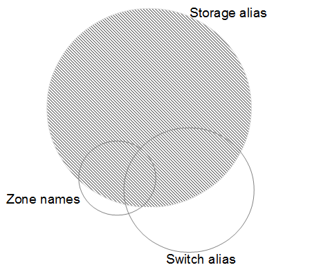

= Prima di iniziare
:allow-uri-read: 
:icons: font
:imagesdir: ../media/

[role="lead"]
Prima di definire le regole per l'identificazione dei dispositivi, è necessario conoscere la configurazione dell'ambiente. Più informazioni sull'ambiente, più facile sarà l'identificazione dei dispositivi.

Devi rispondere a domande simili a quelle riportate di seguito per aiutarti a creare regole precise:

* Il tuo ambiente dispone di standard di denominazione per zone o host e quale percentuale di questi è accurata?
* L'ambiente utilizza un alias dello switch o uno storage e corrispondono al nome host?
* Il tuo ambiente utilizza uno strumento SRM ed è possibile utilizzarlo per identificare i nomi host? Quale copertura offre l'SRM?
* Con quale frequenza cambiano gli schemi di denominazione nel tuo ambiente?
* Ci sono state acquisizioni o fusioni che hanno introdotto diversi schemi di denominazione?

Dopo aver analizzato l'ambiente, dovresti essere in grado di identificare gli standard di denominazione esistenti che ci si può aspettare di incontrare in termini di affidabilità. Le informazioni raccolte potrebbero essere rappresentate graficamente in una figura simile alla seguente:

In questo esempio, il maggior numero di dispositivi è rappresentato in modo affidabile dagli alias dello storage. Le regole che identificano gli host che utilizzano gli alias dello storage devono essere scritte per prime, le regole che utilizzano gli alias switch devono essere scritte per poi essere scritte per prime e le ultime regole create devono utilizzare gli alias della zona. A causa della sovrapposizione dell'utilizzo di alias di zona e switch, alcune regole di alias dello storage potrebbero identificare dispositivi aggiuntivi, lasciando meno regole richieste per alias di zona e switch.

== Procedura per la definizione dei dispositivi nell'ambiente

In genere, per identificare i dispositivi nell'ambiente in uso, si utilizza un flusso di lavoro simile a quello riportato di seguito. L'identificazione è un processo iterativo e potrebbe richiedere più fasi di pianificazione e definizione delle regole.

image::../media/ar-workflow-final.gif[workflow ar finale]

[NOTE]
====
Se nell'ambiente sono presenti dispositivi non identificati (noti anche come "`sconosciuti`" o generici) e successivamente si configura un'origine dati che li identifichi al momento del polling, questi non verranno più visualizzati o conteggiati come dispositivi generici.

====