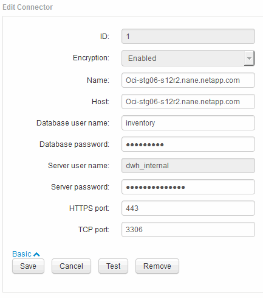

= Modifica delle password "inventario" e "dwh_internal" utilizzando l'interfaccia utente di configurazione della connessione al server
:allow-uri-read: 
:icons: font
:imagesdir: ../media/

[role="lead"]
Se è necessario modificare le password "`Inventory`" o "`dwh_internal`" in modo che corrispondano a quelle del server Insight, utilizzare l'interfaccia utente di Data Warehouse.

== Prima di iniziare

Per eseguire questa attività, è necessario essere connessi come amministratore.

== Fasi

. Accedere al Data Warehouse Portal all'indirizzo https://hostname/dwh[], Dove hostname è il nome del sistema in cui è installato il data warehouse di OnCommand Insight.
. Dal riquadro di navigazione a sinistra, fare clic su *connettori*.
+
Viene visualizzata la schermata *Edit Connector* (Modifica connettore).

+
image::../media/dwh-passwords1.gif[dwh password1]

. Immettere una nuova password "`Inventory`" per il campo *Database password*.
. Fare clic su *Save* (Salva)
. Per modificare la password "`dwh_internal`", fare clic su *Advanced.*
+
Viene visualizzata la schermata Edit Connector Advanced (Modifica avanzate connettore).

+

. Inserire la nuova password nel campo *Server password*:
. Fare clic su Save (Salva)

