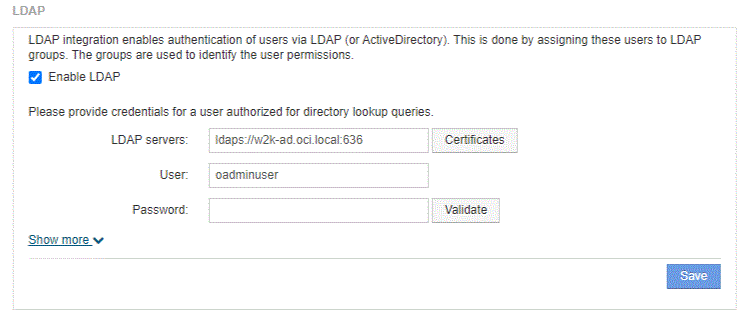

= Configurazione delle definizioni utente mediante LDAP
:allow-uri-read: 
:experimental: 
:icons: font
:imagesdir: ../media/

[role="lead"]
Per configurare OnCommand Insight (OCI) per l'autenticazione utente e l'autorizzazione da un server LDAP, è necessario definire nel server LDAP l'amministratore del server OnCommand Insight.

== Prima di iniziare

È necessario conoscere gli attributi utente e gruppo configurati per Insight nel dominio LDAP.

Per tutti gli utenti di Secure Active Directory (ad esempio LDAPS), è necessario utilizzare il nome del server ad esattamente come definito nel certificato. Non è possibile utilizzare l'indirizzo IP per l'accesso ad sicuro.

== A proposito di questa attività

OnCommand Insight supporta LDAP e LDAPS tramite server Microsoft Active Directory. Ulteriori implementazioni LDAP potrebbero funzionare, ma non sono state qualificate con Insight. Questa procedura presuppone che si stia utilizzando Microsoft Active Directory versione 2 o 3 LDAP (Lightweight Directory Access Protocol).

Gli utenti LDAP vengono visualizzati insieme agli utenti definiti localmente nell'elenco *Admin* > menu:Setup[Users].

== Fasi

. Nella barra degli strumenti Insight, fare clic su *Admin*.
. Fare clic su *Setup*.
. Fare clic sulla scheda *utenti*.
. Scorrere fino alla sezione LDAP, come illustrato di seguito.
+

. Fare clic su *Enable LDAP* (attiva LDAP) per consentire l'autenticazione e l'autorizzazione dell'utente LDAP.
. Compilare i campi:
+
** `LDAP servers`: Insight accetta un elenco separato da virgole di URL LDAP. Insight tenta di connettersi agli URL forniti senza eseguire la convalida per il protocollo LDAP.
+
[NOTE]
====
Per importare i certificati LDAP, fare clic su *certificati* e importare automaticamente o individuare manualmente i file dei certificati.

====
+
L'indirizzo IP o il nome DNS utilizzato per identificare il server LDAP viene in genere inserito nel seguente formato:

+
[listing]
----
ldap://<ldap-server-address>:port
----
+
oppure, se si utilizza la porta predefinita:

+
[listing]
----
 ldap://<ldap-server-address>
----
+
Quando si immettono più server LDAP in questo campo, assicurarsi di utilizzare il numero di porta corretto in ciascuna voce.

** `User name`: Immettere le credenziali di un utente autorizzato per le query di ricerca directory sui server LDAP.
** `Password`: Inserire la password per l'utente precedente. Per confermare la password sul server LDAP, fare clic su *convalida*.

. Se si desidera definire questo utente LDAP con maggiore precisione, fare clic su *Mostra altri* e compilare i campi degli attributi elencati.
+
Queste impostazioni devono corrispondere agli attributi configurati nel dominio LDAP. In caso di dubbi sui valori da inserire per questi campi, rivolgersi all'amministratore di Active Directory.

+
** *Gruppo amministratori*
+
Gruppo LDAP per utenti con privilegi Insight Administrator. Il valore predefinito è `insight.admins`.

** *Gruppo utenti*
+
Gruppo LDAP per utenti con privilegi Insight User. Il valore predefinito è `insight.users`.

** *Gruppo ospiti*
+
Gruppo LDAP per utenti con privilegi Insight Guest. Il valore predefinito è `insight.guests`.

** Gruppo *Server Admins*
+
Gruppo LDAP per utenti con privilegi di amministratore di Insight Server. Il valore predefinito è `insight.server.admins`.

** *Timeout*
+
Tempo di attesa di una risposta dal server LDAP prima del timeout, espresso in millisecondi. il valore predefinito è 2,000, che è adeguato in tutti i casi e non deve essere modificato.

** *Dominio*
+
Nodo LDAP in cui OnCommand Insight dovrebbe iniziare a cercare l'utente LDAP. In genere si tratta del dominio di primo livello dell'organizzazione. Ad esempio:

+
[listing]
----
DC=<enterprise>,DC=com
----
** *Attributo nome principale utente*
+
Attributo che identifica ciascun utente nel server LDAP. Il valore predefinito è `userPrincipalName`, che è unico a livello globale. OnCommand Insight tenta di far corrispondere il contenuto di questo attributo con il nome utente fornito in precedenza.

** *Attributo ruolo*
+
Attributo LDAP che identifica la misura dell'utente all'interno del gruppo specificato. Il valore predefinito è `memberOf`.

** *Attributo Mail*
+
Attributo LDAP che identifica l'indirizzo e-mail dell'utente. Il valore predefinito è `mail`. Questa opzione è utile se si desidera iscriversi ai report disponibili presso OnCommand Insight. Insight rileva l'indirizzo e-mail dell'utente la prima volta che ciascun utente effettua l'accesso e non lo cerca dopo.

+
[NOTE]
====
Se l'indirizzo e-mail dell'utente cambia sul server LDAP, assicurarsi di aggiornarlo in Insight.

====
** *Attributo nome distinto*
+
Attributo LDAP che identifica il nome distinto dell'utente. il valore predefinito è `distinguishedName`.

. Fare clic su *Save* (Salva).

