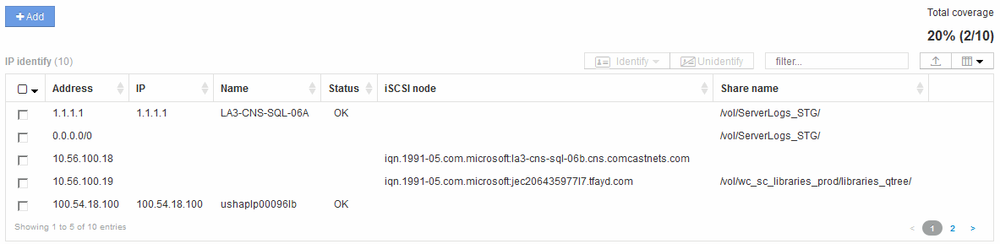

= Risoluzione del dispositivo IP
:allow-uri-read: 
:icons: font
:imagesdir: ../media/

[role="lead"]
La schermata IP Identify (identificazione IP) visualizza tutte le condivisioni iSCSI e CIFS o NFS identificate dalla risoluzione automatica del dispositivo o dalla risoluzione manuale del dispositivo. Vengono visualizzati anche i dispositivi non identificati. La schermata include l'indirizzo IP, il nome, lo stato, il nodo iSCSI e il nome di condivisione dei dispositivi. Viene visualizzata anche la percentuale di dispositivi identificati correttamente.

