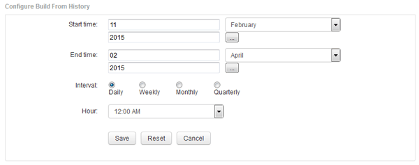

= Aggiunta di un job che crea un database Data Warehouse dalla cronologia
:allow-uri-read: 
:icons: font
:imagesdir: ../media/

[role="lead"]
È possibile creare il database del data warehouse utilizzando i dati storici memorizzati nel server OnCommand Insight, che consentono di eseguire report di proiezione.

== Prima di iniziare

È necessario aggiornare le annotazioni nel server OnCommand Insight e forzare un aggiornamento delle informazioni di annotazione per il data warehouse.

== Fasi

. Accedere al Data Warehouse Portal all'indirizzo `+https://hostname/dwh+`, dove `hostname` È il nome del sistema in cui è installato il data warehouse di OnCommand Insight.
. Dal riquadro di navigazione a sinistra, fare clic su *Build from History* (Crea dalla cronologia).
+
image::../media/oci-dwh-admin-buildfromhistory-gif.gif[Build from History (Crea dalla cronologia)]

. Fare clic su *Configura*.
+

. Inserire l'ora di inizio e di fine.
+
Per visualizzare un calendario dal quale è possibile selezionare queste date, fare clic sulla freccia rivolta verso il basso accanto al nome del mese.

+
Il formato dell'ora dipende dalle impostazioni internazionali del server Data Warehouse.

+
Gli orari di inizio e fine devono rientrare nell'intervallo di cronologia contenuto in tutti i server OnCommand Insight a cui è collegato il data warehouse, come impostato nell'opzione connettori del portale del data warehouse. Gli orari di inizio e di fine predefiniti riflettono il periodo massimo valido. Il processo di creazione del Data Warehouse viene eseguito automaticamente all'ora specificata.

+
[NOTE]
====
La configurazione di una pianificazione non realistica, ad esempio "`Dogni giorno per 4 anni`", comporta 1460 cicli di costruzione, che potrebbero richiedere 10 giorni.

====
. Scegliere l'intervallo.
+
Se si seleziona un intervallo mensile o settimanale, viene visualizzato il campo giorno. Se si seleziona mensile, giorno è una data. Se si seleziona Settimanale, il giorno è da domenica a sabato.

. Scegliere l'ora in cui verrà eseguita la creazione.
. In alternativa, per ripristinare le impostazioni predefinite delle opzioni, fare clic su *Reset* (Ripristina).
. Fare clic su *Save* (Salva).
. Dalla pagina *Build from History* (Crea dalla cronologia), per eseguire una build al di fuori della build di pianificazione automatica, fare clic su *Run* (Esegui).
+
La colonna Target Time (ora di destinazione) visualizza l'ora in cui è stata creata questa voce. La colonna Status (Stato) indica se la creazione è stata completata o meno.

