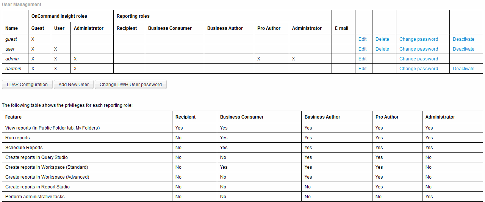

= Gestione degli account utente
:allow-uri-read: 
:icons: font
:imagesdir: ../media/

[role="lead"]
È possibile configurare account utente, autenticazione utente e autorizzazione utente dal portale Data Warehouse. A ciascun account utente viene assegnato un ruolo con uno dei seguenti livelli di autorizzazione. Il numero di utenti è limitato dal numero di licenze di Reporting associate a ciascun ruolo.

== Fasi

. Accedere al Data Warehouse Portal all'indirizzo `+https://hostname/dwh+`, dove `hostname` È il nome del sistema in cui è installato il data warehouse di OnCommand Insight.
. Dal riquadro di navigazione a sinistra, fare clic su *User Management* (Gestione utenti).
+

. Effettuare una delle seguenti operazioni:
+
** Per modificare un utente esistente, selezionare la riga dell'utente e fare clic su *Edit* (Modifica).
** Per modificare la password di un utente, selezionare la riga dell'utente e fare clic su *Change password* (Modifica password).
** Per eliminare un utente, selezionare la riga dell'utente e fare clic su *Delete* (Elimina)

. Per attivare o disattivare un utente, selezionare la riga corrispondente e fare clic su *Activate* o *Deactivate*.

