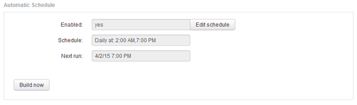

= Pianificazione delle build giornaliere
:allow-uri-read: 
:icons: font
:imagesdir: ../media/

[role="lead"]
Sebbene sia possibile creare manualmente Data Warehouse utilizzando il controllo build Now in qualsiasi momento, è consigliabile pianificare le build automatiche, definendo quando e con quale frequenza creare il database Data Warehouse. Data Warehouse esegue un processo di creazione per ciascun connettore e per ciascun data mart. Data Warehouse esegue un processo di creazione per ciascun connettore per le licenze e l'inventario e tutti gli altri processi di creazione (ad esempio, la capacità) vengono eseguiti sul database consolidato.

== A proposito di questa attività

Ogni volta che il Data Warehouse viene costruito, esegue un processo di inventario per ogni connettore. Una volta completati i job di inventario, Data Warehouse esegue i job per dimensioni, capacità e data mart rimanenti.

== Fasi

. Accedere al Data Warehouse Portal all'indirizzo `+https://hostname/dwh+`, dove `hostname` È il nome del sistema in cui è installato il data warehouse di OnCommand Insight.
. Dal riquadro di navigazione a sinistra, fare clic su *Edit Schedule* (Modifica pianificazione).
+

. Nella finestra di dialogo *Crea pianificazione*, fare clic su *Modifica* per aggiungere una nuova pianificazione.
+
image::../media/oci-dwh-admin-schedule-edit-gif.gif[Modifica pianificazione DWH]

. Scegliere la frequenza - settimanale.
. Scegliere l'ora del giorno per ogni giorno in cui si desidera eseguire il processo.
. Scegliere N/D per i giorni in cui non si desidera eseguire la build.
. Per attivare la pianificazione, selezionare *Enabled* (attivato).
+
[NOTE]
====
Se non si seleziona questa opzione, la generazione della pianificazione non viene eseguita.

====
. Fare clic su *Save* (Salva).
. Per creare data warehouse al di fuori della build pianificata automatica, fare clic su *Crea ora*.

