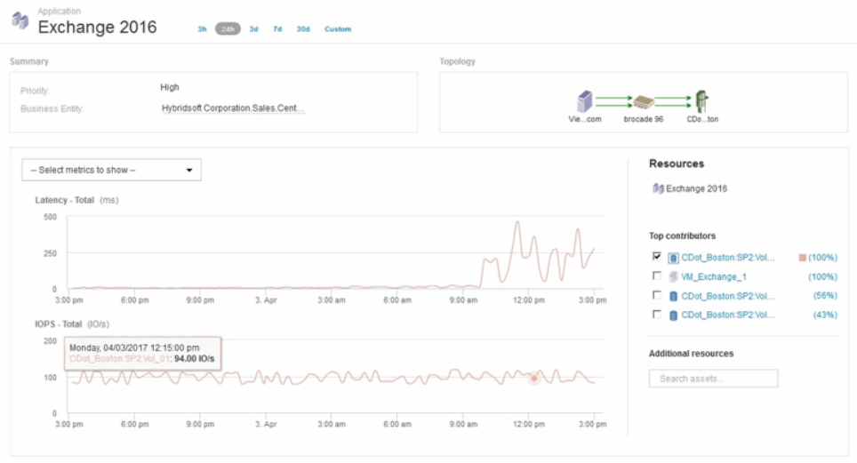
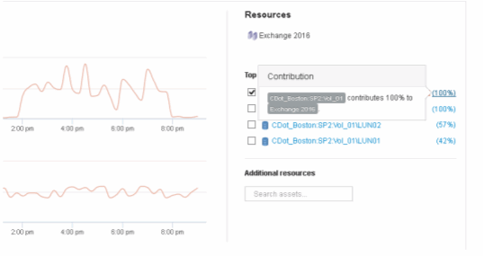

= Analisi di un problema di performance applicativa
:allow-uri-read: 
:icons: font
:imagesdir: ../media/

[role="lead"]
Questo documento descrive le operazioni che è possibile eseguire per risolvere i report relativi a problemi di performance di un'applicazione che hanno un impatto su utenti o amministratori. Ad esempio, gli utenti si lamentano del fatto che l'applicazione Exchange sta attraversando periodi di lentezza durante la giornata.

== A proposito di questa attività

In OnCommand Insight, un'applicazione è un'entità configurata. Si assegnano un nome e un'entità aziendale all'applicazione e si assegnano risorse di calcolo e storage all'applicazione. Ciò consente una migliore visione end-to-end dello stato dell'infrastruttura e una gestione più proattiva della gestione delle risorse dell'infrastruttura.

== Fasi

. Per iniziare a esaminare il problema, utilizzare la barra degli strumenti Insight per eseguire una ricerca globale dell'applicazione Exchange.
+
image::../media/search-exchange.gif[cerca in exchange]

+
[TIP]
====
Quando si esegue una ricerca, è possibile aggiungere un descrittore di oggetti prima del nome dell'oggetto per perfezionare i risultati della ricerca.

====
. Quando si seleziona "Exchange 2016" dai risultati della ricerca, viene visualizzata la pagina di destinazione dell'applicazione.
+

+
Nella landing page dell'applicazione sono disponibili le seguenti informazioni:

+
** Nel periodo di tempo di 24 ore selezionato, un aumento della latenza viene mostrato a destra del grafico della latenza.
** Durante il periodo di maggiore latenza non si verificano cambiamenti significativi nel livello di IOPS. Sembra che l'aumento della latenza non sia causato da un utilizzo più pesante delle applicazioni. Non stiamo riscontrando un'elevata domanda di IOPS sullo storage che potrebbe rappresentare il picco di latenza. L'aumento della latenza potrebbe essere dovuto a un fattore esterno.
** A destra dei grafici nella sezione Top Contributors (collaboratori principali), fare clic sul 100% per il volume interno selezionato (CDot_Boston:SP2:Vol_01). Il sistema mostra che questa risorsa contribuisce al 100% all'applicazione Exchange 2016. 
** Fare clic sul collegamento di navigazione per questo volume interno (CDot_Boston:SP2:Vol_01) per accedere alla landing page del volume interno. L'analisi del volume interno potrebbe fornire informazioni relative al picco di latenza.

