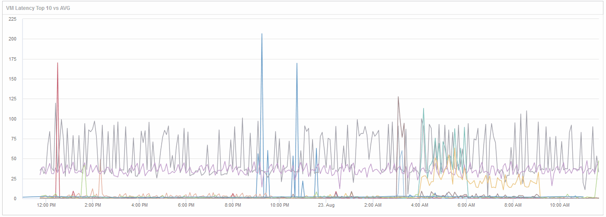

= Confronta gli oggetti con la latenza totale massima di 10 latenza con la latenza media per tutti gli oggetti simili
:allow-uri-read: 
:icons: font
:imagesdir: ../media/

[role="lead"]
Si consiglia di confrontare le macchine virtuali con la latenza totale massima di 10 latenza rispetto alla latenza media totale per identificare quelle che sono estremamente fuori dall'intervallo medio. Queste informazioni potrebbero aiutare nelle decisioni di bilanciamento dei carichi di lavoro sulle macchine virtuali.

== Fasi

. Aggiungere un widget con un grafico ad area sovrapposta alla nuova dashboard: *Widget* > *grafico ad area sovrapposta*
+
.. Impostare il dispositivo predefinito su macchina virtuale: Fare clic su *Storage* > *Virtual Machine* > *latenza totale*
+
Il widget visualizza il totale di latenza, per tutte le macchine virtuali, per 24 ore in un grafico ad area sovrapposta.

.. Creare una seconda visualizzazione in questo widget che mostri la latenza totale media per tutte le macchine virtuali: *Widget* > *grafico a linee*
.. Impostare il dispositivo predefinito su macchina virtuale: Fare clic su *macchina virtuale* > *latenza-totale*
+
Il widget visualizza la latenza totale per il periodo di tempo predefinito di 24 ore utilizzando un grafico a linee.

.. Fare clic su *X* nella barra *Roll-up* e selezionare *Show* > *Top* > *10*

+
Il sistema visualizza le prime 10 macchine virtuali in base alla latenza totale.

. Per confrontare la latenza media totale per tutte le macchine virtuali con il totale dei primi 10 IOPS, attenersi alla seguente procedura:
+
.. Fare clic su *+Aggiungi*
.. Impostare il dispositivo predefinito su macchina virtuale: Fare clic su *Storage* > *Virtual Machine* > *IOPS Total*
.. Fare clic su *X* nella barra *Roll-up* e selezionare *Show* > *Top* > *10*

+
Il sistema visualizza i 10 oggetti con latenza elevata e la latenza media in un grafico a linee.

+
+ 

+
+ la latenza media è di 1.6 ms, mentre nelle prime dieci macchine virtuali la latenza è superiore a 200 ms.

