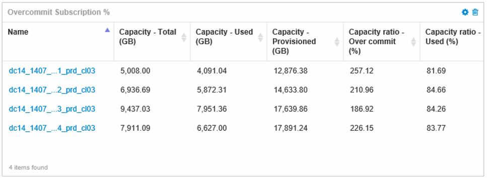

= Creare dashboard per monitorare gli ambienti con thin provisioning
:allow-uri-read: 
:icons: font
:imagesdir: ../media/

[role="lead"]
Le opzioni flessibili di progettazione e visualizzazione dei widget della dashboard di OnCommand Insight consentono un'analisi approfondita dell'utilizzo e dell'utilizzo della capacità, informazioni strategiche per ridurre al minimo i rischi nelle infrastrutture dei data center con thin provisioning.

È possibile creare dashboard che forniscono l'accesso alle informazioni del datastore e del pool di storage che si desidera monitorare.

== Utilizzo di dashboard per accedere alle informazioni del datastore

È possibile creare dashboard che consentono di accedere rapidamente ai dati che si desidera monitorare nell'infrastruttura virtuale. Una dashboard potrebbe includere widget simili ai seguenti per identificare i primi 10 datastore in base alla percentuale di overcommit e un widget che mostra i dati di capacità per i datastore. Le dashboard utilizzano variabili per evidenziare i datastore che sono overcommit di oltre il 150% e i datastore che hanno superato oltre il 80% della capacità utilizzata.

image::../media/new-dashboard-thin.gif[nuova dashboard sottile]

I widget aggiuntivi che potrebbero essere utilizzati per monitorare l'ambiente con thin provisioning potrebbero includere alcune delle seguenti informazioni:

* Capacità VMDK correlate ai datastore
* Capacità delle macchine virtuali
* La capacità del data store ha utilizzato i trend

== Utilizzo di dashboard per accedere alle informazioni del pool di storage

Una dashboard potrebbe includere widget simili ai seguenti, identificando la quantità di capacità di storage fisica utilizzata o identificando la capacità di overcommit per un pool di storage.

image::../media/aggr3c64.gif[aggr3c64]
