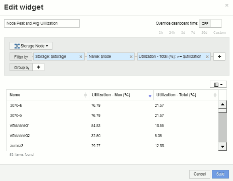

= Esempio di dashboard di utilizzo del nodo di storage con variabili
:allow-uri-read: 
:icons: font
:imagesdir: ../media/

[role="lead"]
Creare una dashboard personalizzata per l'analisi dello storage con variabili per storage, pool di storage, nodo, Tier, utilizzo e latenza.

== Prima di iniziare

La familiarità con i dashboard di Insight è consigliata, ma non necessaria.

== A proposito di questa attività

La seguente procedura consente di creare una dashboard panoramica di analisi dello storage personalizzata che utilizza le variabili per lo storage, il pool di storage, il nodo, il Tier, l'utilizzo e la latenza. Le variabili nell'esempio riportato di seguito verranno utilizzate per filtrare le risorse o le metriche visualizzate in uno o più widget disponibili nella dashboard. I widget che utilizzano queste variabili come filtri verranno aggiornati con contenuti filtrati on-demand in base ai valori immessi nei campi variabili della dashboard, consentendo di filtrare rapidamente più grafici e grafici per eseguire il drill-down di una specifica area di interesse.

Seguendo la procedura descritta in questo esempio, si crea una dashboard come quella riportata di seguito. È possibile modificare questi widget o aggiungere un numero qualsiasi di widget aggiuntivi per evidenziare i dati scelti.

image::../media/node-dashboard-example-2.gif[esempio di dashboard di nodi 2]

== Fasi

. Creare una nuova dashboard e assegnarle il nome "`Analysis: Storage Overview`" (analisi: Panoramica dello storage), o qualcosa di altrettanto descrittivo.
. Fare clic sull'elenco a discesa *Variable* (variabile) e selezionare *Text* variable type (tipo variabile *testo*). Per impostazione predefinita, la variabile è denominata _€var1_. Fare clic su _ var1_ per modificare il nome e impostarlo su _ storage_, quindi fare clic sul segno di spunta per salvare la variabile. Ripetere la procedura per creare variabili di testo per _ nodo_, _ pool_ e _ volume_.
. Ripetere il processo sopra descritto per creare variabili di tipo *Number* denominate _ utilizzo_ e _ latenza_.
. Fare clic sull'elenco a discesa *Variable* (variabile) e cercare l'annotazione _Tier_. Selezionare questa opzione per creare una variabile denominata _ Tier_.
+
È possibile aggiungere variabili in qualsiasi momento, tuttavia è più semplice crearle in anticipo e renderle quindi disponibili a tutti i widget durante la creazione.

. Aggiungere un widget facendo clic sull'elenco a discesa *Widget* e selezionando un widget **line chart**o *area chart*. Assegnare un nome al widget "`Node Utilization`". Fare clic sul tipo di risorsa *Storage* e modificarlo in *Storage Node*. Selezionare *Utilization - Total* (utilizzo - totale) per i dati del grafico.
. Fare clic sul pulsante *Filtra per +* per aggiungere un filtro. Cercare e selezionare *Storage*, quindi fare clic su *Any* e selezionare la variabile _ storage_.
. Fare clic sul pulsante**+**per aggiungere un altro filtro per *Nome*. Impostare la variabile su _ nodo_.
+
È possibile assegnare variabili diverse al filtro dei nomi delle annotazioni. Utilizzare la coppia nome/variabile al livello più basso a seconda dell'oggetto nel widget. Ad esempio:

+
** È possibile assegnare la variabile _ nodo_ al filtro *Nome* per un widget incentrato sul nodo.
** È possibile assegnare la variabile _ pool_ al filtro *Name* per un widget Pool-Focused.

. Fare clic sul pulsante**+**per aggiungere un altro filtro per *Utilization - Total (%)*. Impostare la variabile su _>= utilizzo_ dollari.
. Fare clic su *X* dopo il campo**Roll-up** per comprimere il campo.
. Selezionare *Mostra i primi 5* e fare clic su *Salva* per salvare il widget e tornare alla dashboard.
+
Il widget dovrebbe avere un aspetto simile al seguente:

+
image::../media/widget-node-util-1.gif[nodo widget util 1]

. Aggiungi un altro widget grafico a linee o aree alla dashboard. Selezionare *Storage Node* come tipo di risorsa e *Latency - Total* come metrica da inserire nel grafico.
. Fare clic sul pulsante *Filtra per +* per aggiungere i filtri per *Storage: €storage* e *Name: €node*.
. Aggiungi un filtro per *latenza - totale* e seleziona la variabile * latenza*.
. Assegnare un nome al widget "`Node Latency`" e salvarlo.
. È possibile aggiungere tabelle di supporto per visualizzare ulteriori dettagli per i grafici creati, ad esempio, utilizzo massimo o medio dei nodi. Aggiungere un widget *Table* alla dashboard e selezionare *Storage Node* come tipo di risorsa, quindi creare filtri per *Storage: Storage in dollari*, *Name: Nodo in dollari* e *Utilization - Total: Utilizzo in dollari*.
. Aggiungere colonne alla tabella per *Utilization - Max*, *Utilization - Total* o qualsiasi altra colonna desiderata.
. Assegnare un nome al widget "`Node Peak and Avg Utilization`" e salvarlo.
+

. Ripetere i passaggi per creare una tabella per la latenza del nodo, che mostra *latenza - Max*, *latenza - totale* o altre colonne come desiderato.
. Per completare la dashboard, è possibile aggiungere ulteriori widget di tabella e grafico per alcuni o tutti i seguenti elementi:

|===

| Grafico | Tabella 

 a| 
Utilizzo del pool di storage
 a| 
Utilizzo medio e massimo del pool di storage

 a| 
Throughput del pool di storage
 a| 
Throughput medio e picco del pool di storage

 a| 
Latenza del volume
 a| 
Volume Peak e latenza media

 a| 
IOPS del volume
 a| 
Volume Peak (picco volume) e AVG IOPS (IOPS medio

|===
. Puoi spostare e ridimensionare i widget in qualsiasi posizione sulla dashboard. Al termine, assicurarsi di *salvare* la dashboard.
+
La tua dashboard finale avrà un aspetto simile al seguente:

+
image::../media/node-dashboard-example-2.gif[esempio di dashboard di nodi 2]

. È possibile utilizzare le variabili per concentrarsi su risorse specifiche nella dashboard. Quando si immettono valori nei campi variabili, i widget vengono aggiornati automaticamente per riflettere tali variabili. Ad esempio, inserendo "`15`" nel campo della variabile di utilizzo dei dollari, i widget che utilizzano tale variabile vengono aggiornati per visualizzare solo le risorse con un utilizzo totale >= 15%.
+
Widget di utilizzo del nodo che mostra i primi 5 di tutti i nodi:

+
image::../media/nodeutil-unfiltered.gif[nodeutil non filtrato]

+
Widget di utilizzo dei nodi che mostra i nodi con un utilizzo pari o superiore al 15%:

+
image::../media/nodeutil-filtered.gif[nodeutil filtrato]

. Durante la creazione dei widget, tenere presente quanto segue:
+
** La variabile del Tier di dollari avrà un impatto solo sulle risorse annotate con l'annotazione *Tier*.
** Non tutti i filtri influiscono su tutti i widget, a seconda che il widget sia progettato per accettare le variabili specificate.
** Le variabili numeriche vengono applicate come "`maggiore o uguale a`" il valore specificato. Si noti che qualsiasi variabile può essere utilizzata come filtro su qualsiasi widget a qualsiasi livello di una gerarchia di storage, purché la variabile sia valida per la risorsa in base alla quale il widget è in esecuzione. Man mano che si passa da un livello di nodo a un pool di storage a un widget di volume, sono presenti più variabili da assegnare come filtri. Ad esempio, in un widget a livello di nodo di storage, le variabili _Storage_ e _Name_ possono essere assegnate come filtri. A livello di Storage Pool, sono disponibili _Storage_, _Node_, _Storage Pool_ e _Name_. Assegnare le variabili in base alle esigenze e utilizzare la variabile del nome del dollaro al livello più basso dello stack. In questo modo, la variabile del tuo nome sarà in grado di filtrare il nome effettivo della risorsa in base alla quale il widget è in esecuzione.

