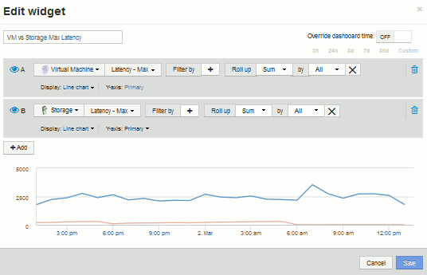

= Dashboard personalizzato: Performance delle macchine virtuali
:allow-uri-read: 
:icons: font
:imagesdir: ../media/

[role="lead"]
I dashboard e i widget personalizzati di OnCommand Insight offrono viste operative sui trend di inventario e performance.

== A proposito di questa attività

Le operazioni IT devono affrontare molte sfide. Agli amministratori viene chiesto di fare di più con meno risorse e avere una visibilità completa nei data center dinamici è un must. In questo esempio, ti mostreremo come creare una dashboard personalizzata con widget che ti forniranno informazioni operative sulle performance delle macchine virtuali nel tuo ambiente. Seguendo questo esempio e creando widget per soddisfare le tue esigenze specifiche, potrai visualizzare le performance dello storage back-end rispetto alle performance delle macchine virtuali front-end o visualizzare la latenza delle macchine virtuali rispetto alla domanda di i/O.

I dashboard personalizzati consentono di assegnare priorità agli sforzi e identificare la disponibilità delle risorse. Puoi rispondere al flusso e al flusso di workload e ridurre al minimo il tempo necessario per rilevare e risolvere i problemi emergenti. Le dashboard personalizzate ti consentono di creare viste con priorità nell'infrastruttura business-critical e sono utili per identificare la disponibilità delle performance nelle tecnologie multi-vendor.

In questa sezione verrà creata una dashboard per le performance delle macchine virtuali contenente quanto segue:

* Una tabella che elenca i nomi delle macchine virtuali e i dati relativi alle performance
* Un grafico che confronta la latenza delle macchine virtuali con la latenza dello storage
* Un grafico che mostra gli IOPS totali, di lettura e scrittura per le macchine virtuali
* Un grafico che mostra il throughput massimo per le macchine virtuali

Questo è solo un esempio di base. Puoi personalizzare la dashboard per evidenziare e confrontare i dati sulle performance che scegli di indirizzare alle tue Best practice operative.

== Fasi

. Accedere a Insight come utente con autorizzazioni amministrative.
. Dal menu *Dashboard*, selezionare *+nuovo dashboard*.
+
Viene visualizzata la pagina nuovo dashboard.

. Diamo un nome significativo alla nostra dashboard. Fare clic su *Save* (Salva). Nel campo *Nome*, immettere un nome univoco per la dashboard, ad esempio "`VM Performance by Application`".
. Fare clic su *Save* (Salva) per salvare la dashboard con il nuovo nome.
. Iniziamo ad aggiungere i nostri widget. Se necessario, spostare l'interruttore *Edit* su "`on`" per attivare la modalità di modifica.
. Fare clic sul pulsante *widget* e selezionare *widget tabella* per aggiungere un nuovo widget tabella alla dashboard.
+
Viene visualizzata la finestra di dialogo Edit Widget (Modifica widget). Il nome predefinito è "`Widget 1`" e i dati predefiniti visualizzati sono relativi a tutti gli storage dell'ambiente.

+
image::../media/customdash-vm-table-1.gif[tabella delle macchine virtuali customdash 1]

. Possiamo personalizzare questo widget. Nel campo Nome, eliminare "`Widget 1`" e immettere "`Virtual Machine Performance Table`".
. Fare clic sull'elenco a discesa tipo di risorsa e modificare *Storage* in *Virtual Machine*.
+
I dati della tabella vengono modificati per mostrare tutte le macchine virtuali nell'ambiente. Per ora, la tabella mostra solo i nomi delle macchine virtuali. Aggiungiamo alcune colonne alla tabella.

. Fare clic su *colonne*image:../media/column-picker-button.gif[""] E selezionare _Data Center_, _Storage name_ e _IOPS - Total_. Puoi anche provare a digitare il nome nella ricerca per visualizzare rapidamente i campi desiderati.
+
Queste colonne vengono ora visualizzate nella tabella. È possibile ordinare la tabella in base a una di queste colonne. Le colonne vengono visualizzate nell'ordine in cui sono state aggiunte al widget.

. Per questo esercizio escludiamo le macchine virtuali che non sono attivamente in uso, quindi filtriamo qualsiasi elemento con meno di 10 IOPS totali. Fare clic sul pulsante"` + `"accanto a *Filtra per* e selezionare__IOPS - Total (io/s)__. Fare clic su *qualsiasi* e digitare "`10`" nel campo *da*. Lasciare vuoto il campo *to*. Fare clic su image:../media/check-box-ok.gif[""] per salvare il filtro.
+
La tabella ora mostra solo le macchine virtuali con 10 o più IOPS totali.

. È possibile comprimere ulteriormente la tabella raggruppando i risultati. Fare clic sul pulsante"` + `" accanto a *Raggruppa per* e selezionare un campo per cui raggruppare, ad esempio applicazione o cluster. Il raggruppamento viene applicato automaticamente.
+
Le righe della tabella vengono ora raggruppate in base alle impostazioni. È possibile espandere e comprimere i gruppi in base alle esigenze. Le righe raggruppate mostrano i dati arrotolati per ciascuna colonna. Alcune colonne consentono di scegliere il metodo di rolloup per tale colonna.

+
image::../media/custom-dashboard-editwidget-table-populated-5-5.png[tabella editwidget dashboard personalizzata compilata 5 5]

. Una volta personalizzato il widget della tabella in base alle proprie esigenze, fare clic sul pulsante *Save* (Salva).
+
Il widget della tabella viene salvato nella dashboard.

. Puoi ridimensionare il widget sulla dashboard trascinando l'angolo in basso a destra. Allarga il widget per mostrare tutte le colonne in modo chiaro. Fare clic su *Save* (Salva) per salvare la dashboard corrente.
. Successivamente aggiungeremo alcuni grafici per mostrare le nostre performance delle macchine virtuali. Creiamo un grafico a linee che confronta la latenza delle macchine virtuali con la latenza dello storage.
. Se necessario, spostare l'interruttore *Edit* su "`on`" per attivare la modalità di modifica.
. Fare clic sul pulsante *Widget* e selezionare *Line Chart* per aggiungere un nuovo widget grafico a linee alla dashboard.
+
Viene visualizzata la finestra di dialogo Edit Widget (Modifica widget). Fare clic sul campo *Nome* e assegnare un nome al widget "`VM vs Storage Max Latency`"

. Selezionare *Virtual Machine* e scegliere *Latency - Max*. Impostare i filtri desiderati oppure lasciare vuoto il campo *Filtra per*. Per *Roll up*, scegliere "`Sum`" da "`all`". Visualizzare questi dati come * Line Chart** e lasciare l'asse Y come *primario*.
. Fare clic sul pulsante *+Aggiungi* per aggiungere una seconda riga di dati. Per questa riga, selezionare *Storage* e *Latency - Max*. Impostare i filtri desiderati oppure lasciare vuoto il campo *Filtra per*. Per *Roll up*, scegliere "`Sum`" da "`all`". Visualizzare questi dati come * Line Chart** e lasciare l'asse Y come *primario*.
+

. Fare clic su *Save* (Salva) per aggiungere questo widget alla dashboard.
. Successivamente, aggiungeremo un grafico che mostra gli IOPS totali, di lettura e scrittura delle macchine virtuali in un singolo grafico.
. Fare clic sul pulsante *Widget* e selezionare *Area Chart* per aggiungere un nuovo widget di area chart alla dashboard.
+
Viene visualizzata la finestra di dialogo Edit Widget (Modifica widget). Fare clic sul campo *Nome* e assegnare un nome al widget "`VM IOPS`"

. Selezionare *Virtual Machine* e scegliere *IOPS - Total*. Impostare i filtri desiderati oppure lasciare vuoto il campo *Filtra per*. Per *Roll up*, scegliere "`Sum`" da "`all`". Visualizzare questi dati come * grafico area** e lasciare l'asse Y come *primario*.
. Fare clic sul pulsante +Add (Aggiungi) per aggiungere una seconda riga di dati. Per questa riga, selezionare *Virtual Machine* e scegliere *IOPS - Read*. Lasciare l'asse Y come *primario*.
. Fare clic sul pulsante +Add (Aggiungi) per aggiungere una terza riga di dati. Per questa riga, selezionare *Virtual Machine* e scegliere *IOPS - Write*. Lasciare l'asse Y come *primario*.
+
image::../media/custom-dashboard-vm-iops-chart.gif[tabella iops vm dashboard personalizzata]

. Fare clic su *Save* (Salva) per aggiungere questo widget alla dashboard.
. Quindi, aggiungeremo un grafico che mostra il throughput delle macchine virtuali per ciascuna applicazione associata alla macchina virtuale. A tale scopo, verrà utilizzata la funzione di rollio.
. Fare clic sul pulsante *Widget* e selezionare *Line Chart* per aggiungere un nuovo widget grafico a linee alla dashboard.
+
Viene visualizzata la finestra di dialogo Edit Widget (Modifica widget). Fare clic sul campo *Nome* e assegnare un nome a questo widget "`VM throughput by Application`"

. Selezionare *Virtual Machine* e scegliere *throughput - Total*. Impostare i filtri desiderati oppure lasciare vuoto il campo *Filtra per*. Per *Roll up*, scegli "`MAX`" e seleziona "`Application`" o "`Name`". Mostra le applicazioni *Top 10*. Visualizzare questi dati come * Line Chart** e lasciare l'asse Y come *primario*.
+
image::../media/customdashboard-vmthroughputsettings.gif[customdashboard vmthrough putsettings]

. Fare clic su *Save* (Salva) per aggiungere questo widget alla dashboard.
. Puoi spostare i widget tenendo premuto il pulsante del mouse in un punto qualsiasi nella parte superiore del widget e trascinandoli in una nuova posizione. Puoi ridimensionare i widget trascinando l'angolo in basso a destra. Assicurarsi di *salvare* la dashboard dopo aver apportato le modifiche.
+
La tua dashboard finale sulle performance delle macchine virtuali avrà un aspetto simile al seguente:

+
image::../media/customdashboard-vm-performance-dashboard.png[dashboard delle performance delle macchine virtuali customdashboard]

