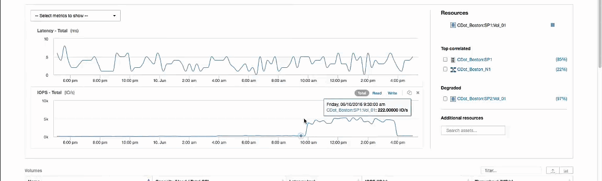

= Esaminare la risorsa avida
:allow-uri-read: 
:icons: font
:imagesdir: ../media/

[role="lead"]
Facendo clic sul volume interno identificato come risorsa avida si apre la landing page del volume CDot_Boston:SP1:Vol_01.

Nota nei dettagli riepilogativi, questo volume interno è una risorsa per un'applicazione diversa (Travel Booking) e, sebbene contenuto in un pool di storage diverso, si trova sullo stesso nodo del volume interno per Exchange 2016 (CDot_Boston_N1)

image::../media/cdot-boston-sp1-part1.gif[cdot boston sp1 parte 1]

La landing page mostra:

* Volume interno associato a un'applicazione Travel Booking.
* Un nuovo pool di storage viene identificato nelle risorse correlate.
* Il volume interno originale che si stava esaminando (CDot_Boston:SP2:Vol_01) è identificato come "`Degraded`".
* Nel grafico delle performance, l'applicazione ha un profilo di latenza costante e presenta un picco IOPS all'incirca nello stesso momento in cui vediamo il picco di latenza sull'applicazione Exchange.
+
Questo potrebbe indicare che il picco di latenza nell'applicazione Exchange è probabilmente causato dal picco IOPS su questo volume.

A destra dei grafici nella sezione Resource, notare la risorsa degradata correlata, ovvero il volume interno di Exchange 2016 (CDot_Boston:SP2:Vol_01). Fare clic sulla casella di controllo per includere il volume interno degradato nel nei grafici delle prestazioni. L'allineamento dei due grafici delle performance mostra che i picchi di latenza e IOPS si verificano quasi esattamente allo stesso tempo. Questo ci dice che vogliamo avere una migliore comprensione dell'applicazione Travel Booking. Dobbiamo capire perché l'applicazione sta riscontrando un picco di IOPS così prolungato.

L'esame del pool di storage associato all'applicazione Travel Booking potrebbe identificare il motivo per cui l'applicazione sta riscontrando il picco IOPS. Fare clic su CDot_Boston:SP1 per visualizzare la landing page dello Storage Pool.
