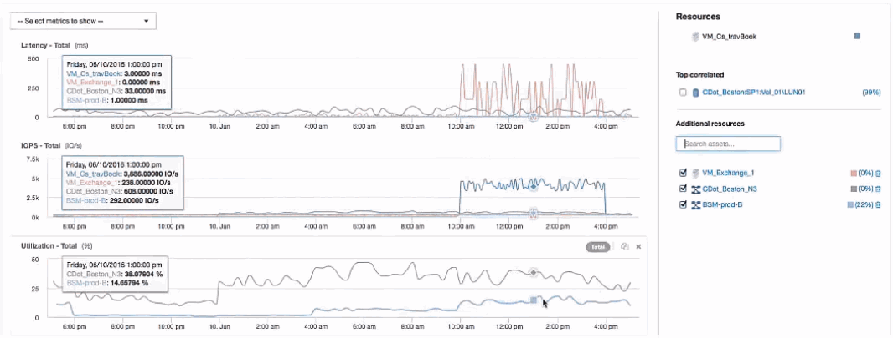

= Esame della macchina virtuale
:allow-uri-read: 
:icons: font
:imagesdir: ../media/

[role="lead"]
Nella landing page delle macchine virtuali, selezionare le metriche aggiuntive da visualizzare e includere l'utilizzo della CPU e della memoria. I grafici relativi all'utilizzo della CPU e della memoria mostrano che entrambi operano a quasi il 100% della capacità. Questo ci indica che il problema del server Exchange non è un problema di storage, ma è il risultato dell'elevato utilizzo della CPU e della memoria delle macchine virtuali e del conseguente scambio di memoria tra i/o e disco.

image::../media/travbook-vm.gif[macchina virtuale travbook]

Per risolvere questo problema, è possibile cercare ulteriori risorse simili. Immettere "`Node`" nella finestra di dialogo di immissione delle risorse aggiuntive per visualizzare le metriche relative alle risorse simili alla VM Exchange. Il confronto può aiutare a identificare un nodo che potrebbe essere più adatto per ospitare il carico di lavoro in caso di necessità di una modifica.

