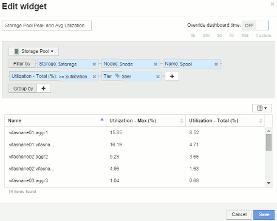

= Esempio di dashboard del nodo impostazioni widget
:allow-uri-read: 
:icons: font
:imagesdir: ../media/

[role="lead"]
Esempio di impostazioni widget per la dashboard dei nodi con variabili.

Di seguito sono riportate le impostazioni per ciascuno dei widget nell'esempio della dashboard del nodo di storage.

Utilizzo del nodo:

image:../media/nodeutilchart.gif[""] image:../media/nodeutiltable.gif[""]

Latenza del nodo:

image:../media/nodelatencychart.gif[""] image:../media/nodelatencytable.gif[""]

Utilizzo del pool di storage:

image:../media/poolutilchart.gif[""] 

Throughput del pool di storage:

image:../media/poolthroughputchart.gif[""] image:../media/poolthroughputtable.gif[""]

Latenza del volume:

image:../media/vollatencychart.gif[""] image:../media/vollatencytable.gif[""]

IOPS del volume:

image:../media/voliopschart.gif[""] image:../media/voliopstable.gif[""]
