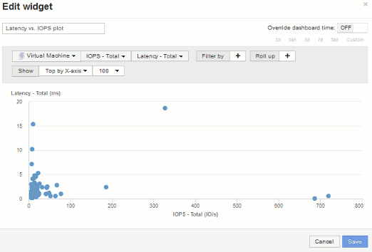

= Esempio di diagramma di dispersione: Conoscere l'asse
:allow-uri-read: 
:icons: font
:imagesdir: ../media/

[role="lead"]
La modifica dell'ordine dei contatori in un widget di scatterplot modifica gli assi su cui vengono visualizzati i dati.

== A proposito di questa attività

In questo esempio viene creato un grafico di dispersione che consente di visualizzare macchine virtuali con performance inferiori e latenza elevata rispetto a IOPS bassi.

== Fasi

. Creare o aprire una dashboard in modalità di modifica e aggiungere un widget *grafico a dispersione*.
. Selezionare un tipo di risorsa, ad esempio *Virtual Machine*.
. Selezionare il primo contatore che si desidera tracciare. Per questo esempio, selezionare *latenza - totale*.
+
_Latenza - totale_ viene indicato lungo l'asse X del grafico.

. Selezionare il secondo contatore che si desidera tracciare. Per questo esempio, selezionare *IOPS - Total*.
+
_IOPS - Total_ viene indicato lungo l'asse Y nel grafico. Le macchine virtuali con latenza superiore vengono visualizzate sul lato destro del grafico. Vengono visualizzate solo le prime 100 macchine virtuali con la latenza più elevata, poiché l'impostazione *inizio per asse X* è corrente.

+
image::../media/scatterplot1.gif[diagramma di dispersione 1]

. Invertire l'ordine dei contatori impostando il primo contatore su *IOPS - Total* e il secondo su *Latency - Total*.
+
_Iatency- Total_ viene ora tracciato lungo l'asse Y nel grafico e__IOPS - Tota__l lungo l'asse X. Le macchine virtuali con IOPS superiori vengono ora visualizzate sul lato destro del grafico.

+
Nota: Poiché non abbiamo modificato l'impostazione *Top by X-axis*, il widget ora visualizza le prime 100 macchine virtuali IOPS più alte, poiché questo è ciò che viene attualmente tracciato lungo l'asse X.

+

. È possibile scegliere se visualizzare il grafico in alto N per asse X, in alto N per asse Y, in basso N per asse X o in basso N per asse Y. Nell'esempio finale, il grafico mostra le prime 100 macchine virtuali con il massimo _IOPS totale_. Se la si modifica in Top by Y-axis, il grafico visualizza nuovamente le prime 100 macchine virtuali con la massima _latenza totale_.
+
Si noti che in un grafico a dispersione, è possibile fare clic su un punto per aprire la pagina delle risorse per tale risorsa.

