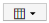

= Evidenziazione dei dati tramite dashboard
:allow-uri-read: 
:icons: font
:imagesdir: ../media/

[role="lead"]
Ora che hai annotato le tue risorse e configurato le policy sulle performance per avvisare in caso di violazioni, puoi creare dashboard per evidenziare i dati specifici che desideri indirizzare.

== A proposito di questa attività

In questo esempio forniremo una vista di alto livello della creazione di dashboard creando una dashboard con un singolo widget che evidenzia i dati delle performance delle macchine virtuali. È possibile aggiungere tutti i widget necessari in una singola dashboard e creare tutte le dashboard necessarie. I widget possono essere ridimensionati e spostati come desiderato.

Ulteriori informazioni su dashboard e widget sono disponibili nella documentazione di OnCommand Insight.

== Fasi

. Accedere a Insight come utente con autorizzazioni amministrative.
. Dal menu *Dashboard*, selezionare *+nuovo dashboard*.
+
Viene visualizzata la pagina nuovo dashboard.

. Best practice: Assegna un nome e salva la dashboard non appena la crei. Fare clic sul pulsante *Save* (Salva) e immettere un nome univoco per la dashboard nel campo *Name* (Nome). Ad esempio "`VM Performance Dashboard`". Fare clic su *Save* (Salva).
. Se necessario, spostare l'interruttore *Edit* su "`on`" per attivare la modalità di modifica. In questo modo è possibile iniziare ad aggiungere widget alla dashboard.
. Fare clic sul pulsante *+widget* e selezionare *Tabella* per aggiungere un nuovo widget tabella alla dashboard.
+
Viene visualizzata la finestra di dialogo Edit Widget (Modifica widget).

. Nel campo Nome, eliminare "`Widget 1`" e immettere "`Virtual Machine Performance Table`".
. Fare clic sull'elenco a discesa tipo di risorsa e modificare *Storage* in *Virtual Machine*.
+
I dati della tabella vengono modificati per mostrare tutte le macchine virtuali nell'ambiente.

. Per aggiungere ulteriori colonne alla tabella, fare clic su *colonne* E selezionare le colonne desiderate, ad esempio__Data Center__, _Storage name_ e _Tier_. È possibile ordinare la tabella in base a una di queste colonne.
. È possibile impostare i filtri in base alle necessità per evidenziare i dati importanti per questa dashboard, ad esempio, è possibile scegliere di visualizzare solo le macchine virtuali con l'annotazione "`Tier 1 - SSD`". Fare clic sul pulsante"` + `"accanto a *Filtra per* e selezionare__Tier__. Fare clic su *Any* e immettere "`Tier 1 - SSD`". Fare clic su image:../media/check-box-ok.gif[""] per salvare il filtro.
+
La tabella ora mostra solo le macchine virtuali nel Tier "`SSD`".

. È possibile raggruppare i risultati facendo clic sul pulsante"` + `" accanto a *Raggruppa per* e selezionando un campo per cui raggruppare, ad esempio il data center. Il raggruppamento viene applicato automaticamente alla tabella.
. Una volta personalizzato il widget in base alle proprie esigenze, fare clic sul pulsante *Save* (Salva).
+
Il widget della tabella viene salvato nella dashboard.

. Puoi ridimensionare il widget sulla dashboard trascinando l'angolo in basso a destra.
. Per aggiungere altri widget, fare clic sul pulsante *+widget*. Ogni widget viene aggiunto alla dashboard quando viene salvato.
. Una volta apportate tutte le modifiche desiderate, fare clic su *Save* (Salva) per salvare la dashboard.
. È possibile creare dashboard aggiuntivi per evidenziare dati diversi.

