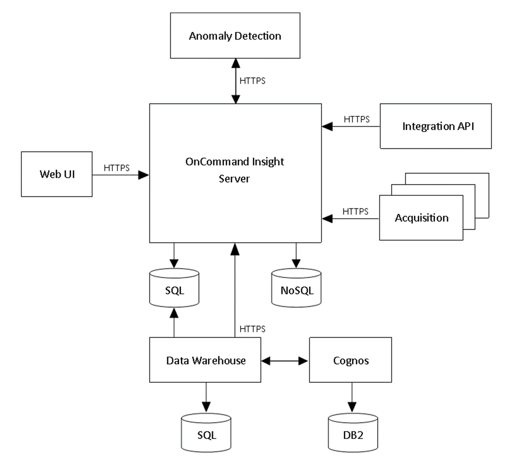

= Architettura Insight
:allow-uri-read: 
:icons: font
:imagesdir: ../media/

[role="lead"]
Un'installazione tipica di OnCommand Insight include acquisizione dei dati e data warehousing con report, tutti facilmente accessibili da un'interfaccia utente basata su web. Per ambienti più sicuri, l'acquisizione può essere eseguita tramite un'unità di acquisizione remota.

I componenti principali dell'architettura Insight sono illustrati nel seguente diagramma:

* *Server OnCommand Insight*
+
Il server OnCommand Insight contiene i principali componenti di analisi e repository di dati. Il server sta continuamente creando una topologia end-to-end dell'ambiente, analizzando l'ambiente e generando avvisi quando viene rilevato un incidente o una violazione.

* *Acquisizione*
+
Il motore di raccolta Insight si basa su una o più unità di acquisizione. Ogni server Insight contiene un'unità di acquisizione locale e può supportare unità di acquisizione remota. Ogni unità è un servizio in esecuzione sulla rete che accede (attraverso moduli denominati _origini dati_) e raccoglie i dati dai dispositivi nel data center. Le informazioni raccolte dalle unità di acquisizione vengono quindi inviate al server per l'analisi.

+
Il motore di raccolta è progettato per essere altamente modulare e facilmente patchato.

* *API di integrazione*
+
Un'API consente la raccolta di dati da agenti esterni. I dati di integrazione possono essere visualizzati nell'interfaccia utente Web utilizzando query e widget. Le dashboard possono contenere dati Insight "nativi" e dati di integrazione. È possibile applicare filtri, roll-up e raggruppamenti ai dati in queste dashboard.

* *Interfaccia utente Web*
+
L'interfaccia utente basata su Web di HTML5 per Insight consente di configurare le origini dati e l'ambiente di monitoraggio, inclusi criteri, soglie e avvisi. Quindi, utilizza la dashboard UIAsset Web e le pagine delle risorse per identificare e ricercare potenziali problemi. Puoi creare dashboard personalizzati con una vasta gamma di widget, ciascuno dei quali offre una flessibilità estesa nella visualizzazione, analisi e inserimento dei dati.

* *Rilevamento anomalie*
+
Le anomalie sono eventi di cambiamento delle performance nell'infrastruttura applicativa che non sono conformi ai modelli precedentemente osservati e previsti. Il rilevamento delle anomalie riguarda l'infrastruttura che serve un'applicazione, identificando le modifiche nei modelli e nei comportamenti di elaborazione. Questi modelli di elaborazione ciclica includono "ebb e flussi" storici nelle performance dei carichi di lavoro durante le ore di funzionamento del business e le operazioni non aziendali.

* *Data Warehouse*
+
Il data warehouse di OnCommand Insight è un repository centralizzato che memorizza i dati provenienti da più server Insight e li trasforma in un modello di dati comune e multidimensionale per le query e l'analisi.

+
Il data warehouse di OnCommand Insight consente di accedere a un database aperto costituito da diversi data mart che consentono di generare report personalizzati sulla capacità e sulle performance, come report di chargeback, report sui trend con dati storici, analisi dei consumi e report di previsione.

+
Il Data Warehouse consolida e prepara i dati per la creazione di report per una o più installazioni di Insight. I dati includono cronologia, trend, inventario, chargeback, show back e presentazioni di dati per supportare la pianificazione a lungo termine dell'infrastruttura del data center.

* *Cognos*
+
Cognos è il motore di reporting per Insight, uno strumento di business intelligence IBM che consente di visualizzare report predefiniti o di creare report personalizzati. Il reporting di Insight genera report dai dati del Data Warehouse.

