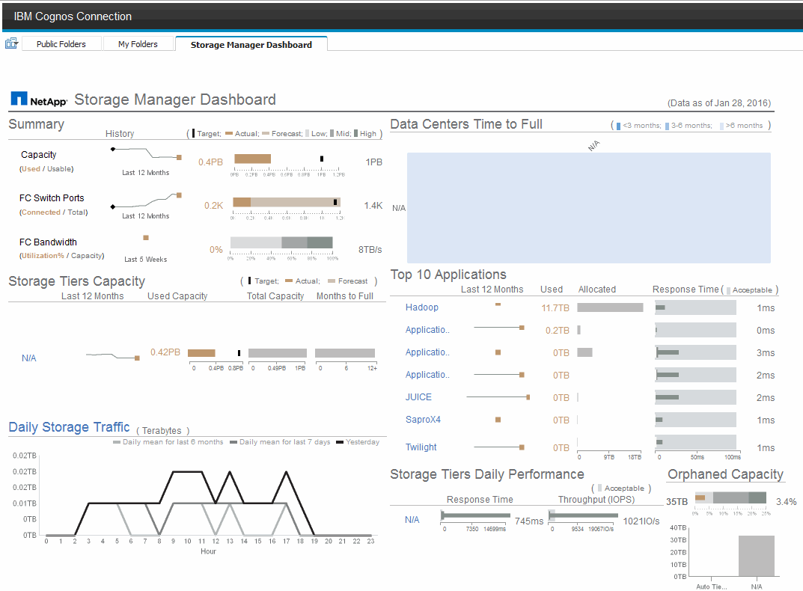

= Cosa ti consente di fare Storage Manager Dashboard
:allow-uri-read: 
:icons: font
:imagesdir: ../media/

[role="lead"]
È possibile utilizzare Storage Manager Dashboard per la gestione quotidiana dei servizi di storage.

La dashboard di Storage Manager offre una visualizzazione centralizzata che consente di confrontare e confrontare l'utilizzo delle risorse nel tempo con gli intervalli accettabili e i giorni di attività precedenti. Mostrando solo le metriche chiave delle performance per i tuoi servizi storage, puoi prendere decisioni su come gestire i tuoi data center.

La dashboard comprende sette componenti che contengono informazioni contestuali su alcuni aspetti dell'ambiente di storage. È possibile approfondire gli aspetti dei servizi storage per eseguire un'analisi approfondita di una sezione che interessa di più.

== Riepilogo

Questo componente mostra la capacità di storage utilizzata rispetto a quella utilizzabile, il numero totale di porte switch rispetto al numero di porte switch connesse e l'utilizzo totale delle porte switch connesse rispetto alla larghezza di banda totale, nonché l'andamento di ciascuna di queste nel tempo. È possibile visualizzare l'utilizzo effettivo rispetto ai range basso, medio e alto, che consente di confrontare e confrontare l'utilizzo tra le proiezioni Insight e gli effettivi desiderati, in base a un target. Per la capacità e le porte dello switch, è possibile configurare questa destinazione. La previsione si basa su un'estrapolazione del tasso di crescita corrente e della data impostata. Quando la capacità utilizzata prevista, che si basa sulla data di proiezione dell'utilizzo futuro, supera la destinazione, viene visualizzato un avviso (cerchio rosso fisso) accanto a Capacity (capacità).

== Capacità dei Tier di storage

Questo componente mostra la capacità del Tier utilizzata rispetto alla capacità allocata al Tier, che indica come la capacità utilizzata aumenta o diminuisce in un periodo di 12 mesi e quanti mesi rimangono alla capacità completa. L'utilizzo della capacità viene visualizzato con i valori forniti per l'utilizzo effettivo, le previsioni di utilizzo da parte di Insight e un target per la capacità, che è possibile configurare. Quando la capacità utilizzata prevista, basata sulla data di proiezione dell'utilizzo futuro, supera la capacità di destinazione, viene visualizzato un avviso (cerchio rosso) accanto a un livello.

È possibile fare clic su qualsiasi Tier per visualizzare il report Storage Pools Capacity and Performance Details, che mostra le capacità gratuite rispetto a quelle utilizzate, il numero di giorni da esaurire e i dettagli delle performance (IOPS e tempo di risposta) per tutti i pool del Tier selezionato. È inoltre possibile fare clic su qualsiasi nome di storage o pool di storage in questo report per visualizzare la pagina delle risorse che riepiloga lo stato corrente di tale risorsa.

== Traffico di storage giornaliero

Questo componente mostra le performance dell'ambiente, in caso di crescita elevata, cambiamenti o potenziali problemi rispetto ai sei mesi precedenti. Mostra inoltre il traffico medio rispetto al traffico dei sette giorni precedenti e del giorno precedente. È possibile visualizzare eventuali anomalie nelle prestazioni dell'infrastruttura, in quanto fornisce informazioni che evidenziano variazioni cicliche (sette giorni precedenti) e stagionali (sei mesi precedenti).

È possibile fare clic sul titolo (*Daily Storage Traffic*) per visualizzare il report Storage Traffic Details, che mostra la mappa termica del traffico di storage orario per il giorno precedente per ciascun sistema di storage. Fare clic su un nome di storage qualsiasi in questo report per visualizzare la pagina delle risorse che riepiloga lo stato corrente della risorsa.

== Data Center Time to Full (i data center sono in fase di

Questo componente mostra tutti i data center rispetto a tutti i Tier e la capacità residua in ogni data center per ciascun Tier di storage in base ai tassi di crescita previsti da Insight. Il livello di capacità del Tier viene visualizzato in blu; più scuro è il colore, minore è il tempo trascorso dal Tier nella posizione prima che sia pieno.

È possibile fare clic su una sezione di un livello per visualizzare il report Storage Pools Days to Full Details (giorni di archiviazione per dettagli completi), che mostra la capacità totale, la capacità libera e il numero di giorni da esaurire per tutti i pool nel Tier selezionato e nel data center. Fare clic su un nome di storage o pool di storage in questo report per visualizzare la pagina delle risorse che riepiloga lo stato corrente della risorsa.

== 10 applicazioni principali

Questo componente mostra le prime 10 applicazioni in base alla capacità utilizzata. Indipendentemente dal modo in cui il Tier organizza i dati, quest'area visualizza la capacità corrente utilizzata e la condivisione dell'infrastruttura. È possibile visualizzare la gamma di esperienze utente dei sette giorni precedenti per verificare se i consumatori sperimentano tempi di risposta accettabili (o, cosa più importante, inaccettabili).

Quest'area mostra anche i trend, che indicano se le applicazioni soddisfano gli obiettivi di performance del livello di servizio (SLO). È possibile visualizzare il tempo di risposta minimo della settimana precedente, il primo quartile, il terzo quartile e il tempo di risposta massimo, con una mediana visualizzata rispetto a un SLO accettabile, che è possibile configurare. Quando il tempo di risposta medio di un'applicazione non rientra nell'intervallo SLO accettabile, accanto all'applicazione viene visualizzato un avviso (cerchio rosso fisso). È possibile fare clic su un'applicazione per visualizzare la pagina delle risorse che riepiloga lo stato corrente di tale risorsa.

== Performance giornaliere dei Tier di storage

Questo componente mostra un riepilogo delle performance del Tier per i tempi di risposta e gli IOPS per i sette giorni precedenti. Queste performance vengono confrontate con un SLO, che è possibile configurare, per verificare se esiste l'opportunità di consolidare i Tier, riallineare i carichi di lavoro forniti da tali Tier o identificare problemi con determinati Tier. Quando il tempo di risposta mediano o l'IOPS mediano non rientra nell'intervallo SLO accettabile, viene visualizzato un avviso (cerchio rosso pieno) accanto a un livello.

È possibile fare clic sul nome di un Tier per visualizzare il report Storage Pools Capacity and Performance Details, che mostra le capacità gratuite rispetto a quelle utilizzate, il numero di giorni da esaurire e i dettagli delle performance (IOPS e tempo di risposta) per tutti i pool del Tier selezionato. Fare clic su uno storage o pool di storage in questo report per visualizzare la pagina delle risorse che riepiloga lo stato corrente della risorsa.

== Capacità orfana

Questa componente mostra la capacità orfana totale e la capacità orfana per Tier, confrontandola con gli intervalli accettabili per la capacità utilizzabile totale e mostrando la capacità effettiva orfana. La capacità orfana è definita dalla configurazione e dalle performance. _Storage orfano per configurazione_ descrive una situazione in cui lo storage è allocato a un host. Tuttavia, la configurazione non è stata eseguita correttamente e l'host non può accedere allo storage. _Orfano per performance_ è quando lo storage è configurato correttamente per l'accesso da parte di un host. Tuttavia, non c'è stato traffico di storage.

La barra orizzontale sovrapposta mostra gli intervalli accettabili. Più scuro è il grigio, più inaccettabile è la situazione. La situazione effettiva viene mostrata con la stretta barra di bronzo che mostra la capacità effettiva che è orfana.

È possibile fare clic su un Tier per visualizzare il report "Orphaned Storage Details" (Dettagli storage orfani), che mostra tutti i volumi identificati come orfani in base alla configurazione e alle performance per il Tier selezionato. Fare clic su qualsiasi storage, pool di storage o volume in questo report per visualizzare la pagina delle risorse che riepiloga lo stato corrente della risorsa.
